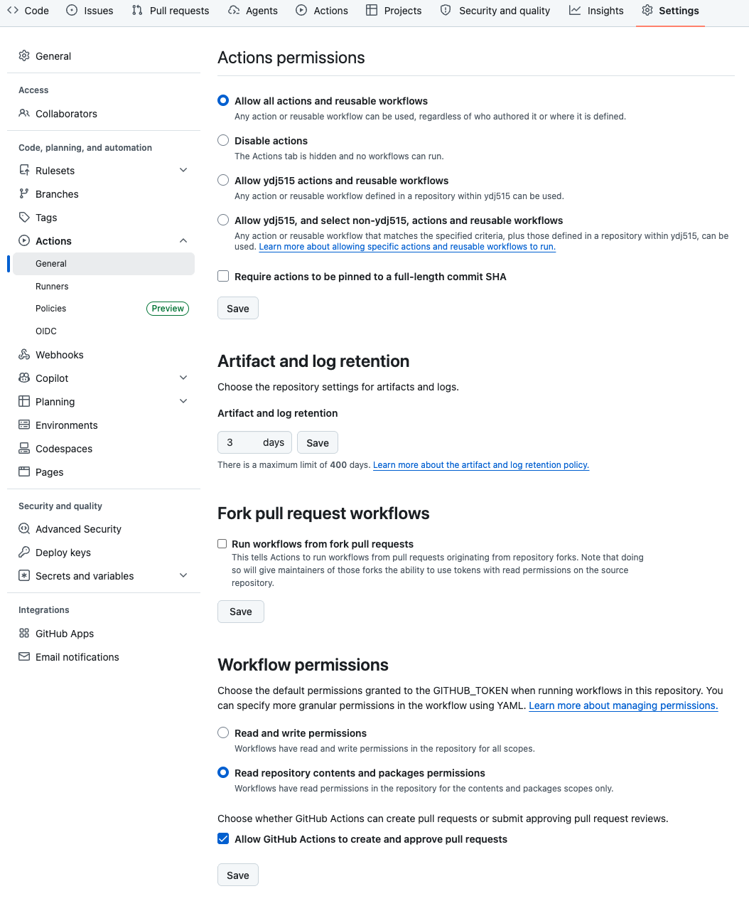

# Sync Development Standards

`.github/workflows/sync-dev-standards.yml`은 `dev-standards`의 선택된 문서를 소비 저장소에
동기화하고, 명시적으로 요청한 경우에만 프로젝트 설정 템플릿을 최초 복사합니다.

## 소비 저장소가 소유하는 파일

소비 저장소는 다음 파일을 직접 작성하고 관리합니다.

| 경로 | 필수 여부 | 역할 |
| --- | --- | --- |
| `.dev-standards/config.yml` | 필수 | 적용할 표준 선택 |
| `.github/workflows/sync-dev-standards.yml` | 필수 | 상시 가이드 동기화 호출 |
| `.github/workflows/bootstrap-dev-standards.yml` | 선택 | 실제 설정 파일 최초 복사 |

React, Spring, Go 설정 예시는 다음 파일을 복사해 시작합니다.

- [`react-config.yml`](../examples/dev-standards/react-config.yml)
- [`spring-gradle-config.yml`](../examples/dev-standards/spring-gradle-config.yml)
- [`go-config.yml`](../examples/dev-standards/go-config.yml)

## 소비 저장소 사전 설정

`delivery_mode: pull-request`를 사용하려면 소비 저장소에서 GitHub Actions의 pull request 생성
권한을 한 번 활성화해야 합니다.

1. 소비 저장소의 **Settings**를 엽니다.
2. 왼쪽 메뉴에서 **Actions > General**을 선택합니다.
3. 화면 아래쪽 **Workflow permissions**에서
   **Allow GitHub Actions to create and approve pull requests**를 선택합니다.
4. 체크박스 바로 아래의 **Save**를 클릭합니다. 화면 위쪽의 **Actions permissions** 또는
   **Artifact and log retention**에 있는 다른 **Save**가 아닙니다.

위의 기본 권한은 **Read repository contents and packages permissions**로 유지해도 됩니다.
필요한 쓰기 권한은 아래처럼 호출 workflow에서 범위를 제한해 선언합니다.



```yaml
permissions:
  contents: write
  pull-requests: write
```

저장소 설정을 활성화하지 않으면 생성 branch push는 성공하더라도 pull request 생성은 실패할
수 있습니다. 실패 후 `automation/dev-standards-sync` branch만 남은 상태에서 workflow를 다시
실행하면 기준 branch와 생성 branch의 차이를 확인하여 누락된 pull request를 생성합니다.

## 입력값

| 입력 | 필수 | 기본값 | 설명 |
| --- | --- | --- | --- |
| `standards_owner` | 예 | 없음 | `dev-standards` 저장소 소유자 |
| `standards_repo` | 아니요 | `dev-standards` | 표준 저장소 이름 |
| `standards_ref` | 아니요 | `latest-release` | 최신 정식 Release, branch, tag 또는 commit SHA |
| `config_path` | 아니요 | `.dev-standards/config.yml` | 소비 저장소의 선택 설정 경로 |
| `sync_gemini` | 아니요 | `true` | `.gemini/styleguide.md` 동기화 여부 |
| `bootstrap_templates` | 아니요 | `false` | agent 파일과 선택 설정의 최초 복사 여부 |
| `bootstrap_agent_files` | 아니요 | `false` | 누락된 agent 진입 파일만 생성할지 여부 |
| `bootstrap_mise_profile` | 아니요 | 빈 값 | 모호한 mise 후보를 선택할 profile |
| `delivery_mode` | 아니요 | `pull-request` | `pull-request` 또는 호환용 `direct` 전달 방식 |
| `lock_path` | 아니요 | `.dev-standards/lock.json` | 적용 버전과 checksum 상태 파일 |
| `pr_branch` | 아니요 | `automation/dev-standards-sync` | 반복 갱신할 pull request branch |

## 두 버전 ref의 의미

호출 설정에는 서로 다른 저장소를 가리키는 두 ref가 있습니다.

```yaml
jobs:
  sync:
    uses: ydj515/ci-workflows/.github/workflows/sync-dev-standards.yml@v1.2.1
    with:
      standards_owner: ydj515
      standards_repo: dev-standards
      standards_ref: latest-release
      delivery_mode: pull-request
```

| 위치 | 대상 저장소 | 결정하는 내용 |
| --- | --- | --- |
| `uses: ...@v1.2.1` | `ci-workflows` | 실행할 reusable workflow의 버전, 입력 계약, checkout·생성·PR 절차 |
| `standards_ref: latest-release` | `dev-standards` | 실행 시점의 최신 정식 Release |

두 버전은 독립적입니다. 예를 들어 workflow 동작은 그대로 유지하면서 표준만 갱신하려면
`standards_ref`만 변경하고, 동기화 방식이나 workflow 입력 계약을 갱신하려면 `uses` 뒤의
ref를 변경합니다. 두 저장소의 변경이 함께 필요한 릴리스에서는 호환되는 두 ref를 같이
올립니다.

ref에는 다음 값을 사용할 수 있습니다.

- `latest-release`: GitHub의 최신 정식 Release tag를 해석합니다.
- `main`: 실행할 때마다 해당 저장소 기본 branch의 최신 상태를 사용합니다.
- `v1.2.0` 같은 tag: 명시한 릴리스 버전을 사용합니다.
- commit SHA: 정확한 commit을 고정하므로 재현성이 가장 높습니다.

주기적 갱신에는 `latest-release`를 사용하고, 재현이 필요한 일회성 실행에는 tag 또는 commit
SHA를 사용합니다. `main`은 소비 저장소의 파일을 변경하지 않아도 다음 실행 결과가 달라질 수
있으므로 운영 동기화에는 사용하지 않습니다.

## 선택 설정 계약

`base`, `languages`, `architectures`, `frameworks`, `builds`, `tools`, `runtimes`는 모두 선택
항목입니다.

- `base`를 생략하면 포함하며, 제외하려면 `base: false`를 지정합니다.
- 언어 선택만으로 architecture를 자동 추론하지 않습니다.
- `architectures`를 생략하면 Spring=`layered-clean`, FastAPI=`feature-layered`,
  React=`feature-sliced`, Next.js=`route-feature` 기본값을 framework 선택에 따라 자동
  조합합니다.
- `react-ts`와 `next-ts`를 함께 선택하면 더 구체적인 `route-feature`가 자동 적용됩니다.
- `architectures: []`는 자동 기본값을 끄고, 하나 이상 명시하면 추론값을 대체합니다.
- 나머지 배열은 생략하거나 빈 배열로 두면 조합하지 않습니다.
- 복수 선택은 block 배열과 inline 배열을 지원합니다.
- Prettier와 Biome는 동시에 선택하지 않습니다.
- 짧은 tool 이름이 중복되면 `languages/python/ruff` 같은 qualified selector를 사용합니다.

Spring의 기본 `layered-clean` 대신 bounded context 우선 구조를 적용하려면 다음처럼
명시합니다.

```yaml
languages: [kotlin]
frameworks: [spring]
architectures: [domain-oriented]
```

## 상시 동기화

[`sync-dev-standards.yml`](../examples/dev-standards/sync-dev-standards.yml)을 소비 저장소의
`.github/workflows/`에 복사합니다. 이 workflow는 다음 생성물만 지속적으로 동기화합니다.

```text
.dev-standards/styleguide.md
.dev-standards/standards/**
.dev-standards/lock.json
.gemini/styleguide.md          # sync_gemini이 true이거나 .gemini/가 이미 있을 때
```

`lock.json`에는 요청 ref, 해석된 Release tag, resolved commit SHA, config checksum, 관리 파일
checksum과 파일 소유권을 기록합니다. 주간 실행 결과가 기존 상태와 같으면 commit과 pull
request를 만들지 않습니다.

이전 `.dev-standards.yml`을 유지해야 하는 전환 기간에는 `config_path`를 명시할 수 있지만,
새 산출물은 항상 `.dev-standards/` 아래에 생성됩니다.

## 최초 Bootstrap

누락된 `AGENTS.md`, `CLAUDE.md`, `GEMINI.md`만 pull request에 추가하려면 상시 동기화
workflow에 다음 입력을 둡니다. 기존 agent 파일과 프로젝트 설정은 변경하지 않습니다.

```yaml
with:
  bootstrap_agent_files: true
```

프로젝트 설정도 채택하려면
[`bootstrap-dev-standards.yml`](../examples/dev-standards/bootstrap-dev-standards.yml)을
소비 저장소의 `.github/workflows/`에 복사하고 `workflow_dispatch`로 실행합니다.

bootstrap은 다음 규칙을 따릅니다.

- 누락된 `AGENTS.md`, `CLAUDE.md`, `GEMINI.md`를 생성합니다.
- 기존 agent 파일은 덮어쓰거나 자동 병합하지 않고 경고 후 보존합니다.
- 하나 이상의 언어를 선택하면 `.editorconfig`를 생성합니다.
- 선택한 build, tool, runtime에 대응하는 실제 설정 파일만 복사합니다.
- 다른 내용의 기존 설정 파일이 있으면 어떤 파일도 복사하기 전에 실패합니다.
- React와 Spring 애플리케이션 디렉터리 또는 소스 코드는 생성하지 않습니다.
- 기존 `build.gradle.kts`는 수정하지 않습니다. 품질 도구 Kotlin DSL 예시는 직접 병합합니다.

여러 mise 후보가 선택되면 profile을 명시합니다.

```yaml
with:
  bootstrap_templates: true
  bootstrap_mise_profile: gradle
```

지원 profile은 `gradle`, `maven`, `go`, `python`, `typescript`입니다.

## Agent 진입 파일

새로 생성되는 agent 파일의 참조 관계는 다음과 같습니다.

```text
CLAUDE.md ─┐
           ├─> AGENTS.md ─> .dev-standards/styleguide.md
GEMINI.md ─┘
```

기존 `AGENTS.md`가 있으면 다음 공유 표준 링크를 직접 병합합니다.

```markdown
## Shared Development Standards

Before modifying code, read `.dev-standards/styleguide.md`.
Repository-specific instructions in this file take precedence over the shared styleguide.
```

`CLAUDE.md`와 `GEMINI.md`는 각각 다음과 같이 `AGENTS.md`만 참조합니다.

```markdown
<!-- CLAUDE.md -->
@AGENTS.md
```

```markdown
<!-- GEMINI.md -->
@./AGENTS.md
```

## 변경 전달

기본 `pull-request` 방식은 `automation/dev-standards-sync` branch를 생성하거나 기존 branch를
갱신하고 pull request를 엽니다. 이미 열린 pull request가 있으면 같은 pull request의 제목과
본문을 갱신합니다. 호출 workflow에는 `contents: write`와 `pull-requests: write` 권한이 모두
필요합니다.

기존 직접 push 동작이 필요한 소비 저장소만 `delivery_mode: direct`를 명시합니다. 보호 branch와
변경 검토를 사용하는 저장소에서는 기본 pull request 방식을 유지합니다.
